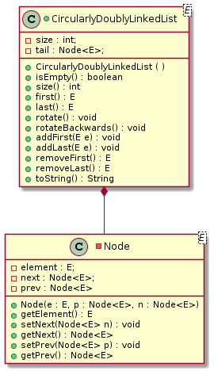

# CS2610-A01

Assignment 1 (Due Oct 1, 23:59h):

(Based on Text Book Question C-3.32)

Implement a circular version of the text book's generic `DoublyLinkedList`, *without any sentinels*, that supports all the public behaviours of the original DoublyLinkedList as well as two new methods: `rotate()`, `rotateBackward()`, you will maintain only a single reference to the underlying nodes in an instance variable called `tail` which references the last element in the circular list. You should make reference to the book's `CircularlyLinkedList` (singly linked) and the book's `DoublyLinkedList` to help you out. The solution should look like a combination of those two. Call your class `CircularlyDoublyLinkedList`

I've implemented a DJ program that will use your `CircularlyDoublyLinkedList` to play a song, such that each time the keyboard is pressed it will reverse the order of playback on the song. The DJ program will also perform some tests to help the grader ensure you've implemented the CircularlyLinkedList properly. If the word error appears in the console output (at the bottom of intellij) then you'll know there are some problems with your `CircularlyDoublyLinkedList` class. 

There is another file that actually generates the audio in `StdAudio.java` you don't need to do anything with that file, nor with the `DJ.java` file.

Note that even though you are implementing methods in a similar way to the `CircularlyLinkedList` Class the implementation may look different on account of you now having `next` and `prev` references. 

Hints and tips: 

* Add a `public static void main(String [] args)` to your CircularlyDoublyLinkedList class where you can test your implementation as you go. 

* Keep pen and paper handy - draw the nodes and your goals so you can translate that to code. 

* Once everything is good try running `DJ.main()`, pressing `g` should play a jingle from a popular fast food restaurant. Pressing `s` will stop the song and pressing any other key should cause the song to play in reverse. The grader will reverse the song a few times to make sure everything seems to be working.

A UML diagram of the class you are to implement is below. Note that the `Node` class is a private inner class of `CircularlyDoublyLinkedList`.



Your repository directory structure should look as follows upon completing the assignment:

```
project
│   README.md
│   uml-diagram.png
│   CircularlyLinkedList.java
|   DoublyLinkedList.java
|
└───A1
    │   DJ.java
    │   StdAudio.java
    │   CircularlyDoublyLinkedList.java
```

Where CircularlyDoublyLinkedList.java contains all your gradable material. Upon cloning this repository you should be able to open the A1 directory directly within IntelliJ and perform all your version control operations from within IntelliJ. 

Deliverables:

1. A working CircularlyDoublyLinkedList as described
2. A directory structure within your repository as laid out above

Grading:

| Description  | Your Grade  | Max Grade  |
|---|---|---|
|Coding Design| - | 4 |
|Functionality| - | 5 | 
|Structure    | - | 1 |


Coding Design - is your code readable? Does it follow design practices as outlined in class? Did you make proper use of private and public variables? Did you implement all the requirements shown in the uml diagram? 

Functionality - does your code implement a working CircularlyDoublyLinkedList?

Structure - is your respository as outlined above? Can the grader run your program without any hassels? Note: that large deviations making it difficult for the grade to execute your program may result in large deductions (beyound a single point). 

Due Date: Sunday Oct 1, 2017 23:59h


