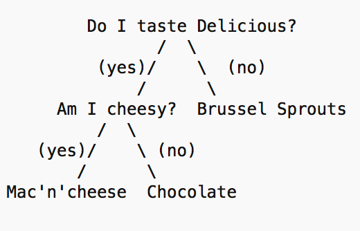

## Computer Science 261 A3 Binary Tree Games
### DUE: Friday Nov 10, 2016 23:55h
 Write a Java program that learns about a topic of your choice (maybe bands, or cars or ice cream) by using a binary tree to play a guessing game. The program allows the state to be saved out to file and loaded at a later time and also some summary stats about the tree structure to be printed out.

Create a general Main Menu with options:

1. Play a game

2. Load knowledge from a file

3. Save knowledge to a file

## Play a game ...

The game works as follows: You will think of a specific animal (or item of your choice, music band, cars, star trek characters, etc) supposing the topic is animal and you think about a CAT. The game will ask you a series of binary questions to determine your animal (your possible response in `BELOW`):

- Think of an animal and I (the computer) will guess it by asking you a series of questions. 
- Does it have legs? `YES`
- Is it a cat? `YES`
- I win! (returns to main menu)

Initially you prime the tree with a single top level question and two answers initially (Does it have legs? Cat and Snake), (Is the Band Awesome? Sloan and Nickelback).

Sample pictoral representation:



In the animal case the initial tree has the following knowledge: `Does it have legs` and the possible (initial) known outcomes: yes: `CAT` and no: `SNAKE` however supposing you choose BlueJay then the computer needs to ask you how to know the difference between a BlueJay and a Cat:

- Think of an animal and I will guess it
- Does it have legs? `YES`
- Is it a cat? `NOPE`
- I’m stumped, What is it? `BLUEJAY`
- Please type a yes/no question, that is yes for a cat but no for a BlueJay: `DOES IT HAVE WINGS?`
- Thanks (return to main menu)

Subsequent games will incorporate this new question at the correct level of the tree so that the computer may differentiate between a cat and a bluejay and ask you the correct question at the correct time.

## Save knowledge to a file ...

This option will prompt the user for a file name. Supposing animal.txt is given then the tree should be written out to file in a manner that allows it to be read back in to a tree in the future. This option writes each node in the tree (not a serialized version of the whole tree) to file. You will need to develop some mechanism to keep track of leaves (animal types) and inner nodes (questions), so that the tree can be loaded into the exact same state.

This may require a bit of thought as to how to be able to write and read trees from file such that the specifics of the tree are retained. I’m looking for a recursive solution here. Hint: use a special marker for nulls - perhaps even the word null to indicate no children. That way when you read the tree back in, you know when something is a leaf (it has nulls for children).


## Load knowledge from a file ...

This option will prompt the user for a file name to load (e.g. animals.txt), and will then open the file animals.txt from the current directory and load the data into a binary tree that works for playing a game (or writing back out to another file). I’m looking for a recursive solution here.

You can extend and use the Binary Tree classes from the book (just cite your source, they are uploaded in L12 and L13 examples). You can also write your own classes from scratch.

## Tips

Get the game working first, then the file i/o. Start by answering this question: what's the difference between a question and an answer in my tree? (they both are just TreeNodes with Strings, but how can we tell them apart *without* adding other variables like boolean isQuestion) 

Also make this interesting for the marker by picking a good topic. Animals are boring and obviously will put the marker into a fowl mood (sorry). 

You will create an A3 project in **IntelliJ** with a class called `TreeGame` (that potentially extends classes from the book - uploaded in L12 and L13 examples) and another file `TreeDriver` that drives the game (the main menu for instance) and calls into a TreeGame object to execute the actual selections.

Grading:

Functionality 5pts - does the game work. can the tree be written out to file and read back in from file. does the basic user interface work.

code design 4pts - have you used proper OO design principles. Are you variable names informative. Are you using local versus class member variables appropriately. Do you have any methods that are simply too long, any repeated code, is your code robust and modular

Structure: 1 pt Does your repository look like the one below, does your intellij project compile and run without fuss.

Total 10 pts.

Your repository should look like this when you are done:
```
CS2610-A3-YOURUSERNAME
|   README.md
|   .gitignore
|___A3
    |   
    |   Your intellij project files here
``` 

