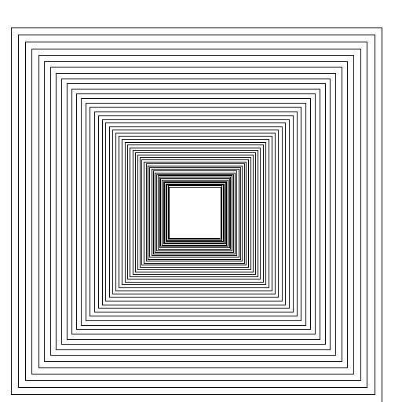
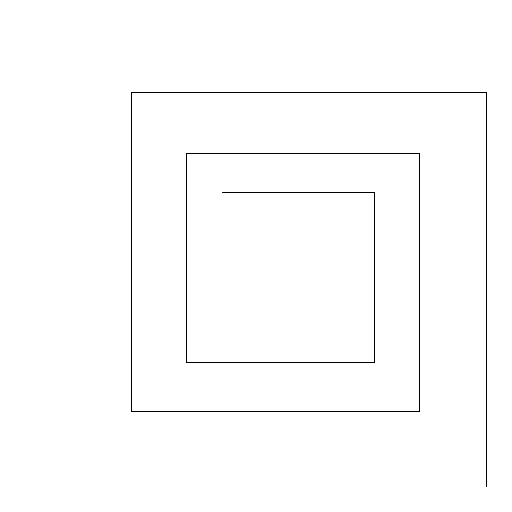

##CS2610-HW2

Open the homework2 Intellij project contained **within** this repository.
Complete Task1.java and Task2.java

Test your solutions by running Task1.main() and/or Task2.main()

Due Monday Oct 9 23:59h


Task 1:
Write a lambda expression so that the code in Task1 prints all of the courses which are in 'CS' and less than 3000 level, i.e., course numbers between less than 3000 in the CS department.

Task 2:

Use the provided Turtle class to create a shrinkingbox shape that looks like the following:



The same code generates both of the above images just the second one has less iterations and larger spacing so it shows the pattern more clearly.

Starting on the outside each side of the box is smaller by a fraction than the last side. This creates a spiraling type shape moving towards the centre.

Certainly an iterative approach like a while loop or for loop is a good way to create a shape like this. However for this homework try using a recursive function for practice.

Turtle has only a few methods that we need to know about.

```java
/** move forward by x fraction of the length of the screen,
 * eg., turtle.goForward(0.1);
* moves the turtle forward by 10 percent of the screen's size
*/
public void goForward(double x)

/**
    rotate the turtle by delta degrees to the left
    e.g., turtle.turnLeft(-90.0);
    rotates the turtle left by -90 degrees (said another way right by 90 degrees)
*/
public void turnLeft(double delta)

```

There are many recursive mathematical functions that you can draw using simple turtle graphics like this. Feel free to explore drawing for example a koch curve or a dragon curve. There is an example tree method provided in the code that you can explore as well.

The Turtle code comes from the book Introduction to programming in Java, and includes a StdDraw.java class and StdOut.java class. They are included so the Turtle class compiles but you otherwise don't need to worry about them.

As with all homework it is graded on a 1 point scale. Checking your solution back into your repository with any displayed effort gets the 1 point.

| Your Grade | Max Grade |
|---|---|
|   | 1 |
